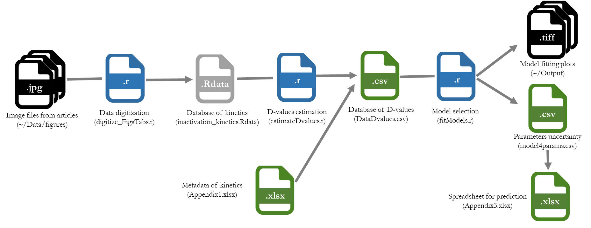

Data and models related to coronaviruses inactivation 
========

## Contents
  * [Introduction](#introduction)
  * [Collecting the kinetics](#collecting)
  * [Retrieving log10 D values from kinetics](#retrieve)
  * [Model selection](#selection)
  * [Citation](#citation)
  * [Licence](#licence)
  
## Introduction

This repository aims at providing data and models relative to loss of infectivity of Coronaviridae family accoring to temperature and relative humidity. 
This project is constituted of three main parts: (i) the collection of coronavirus kinetics from publications, (ii) the estimation of D-values (time needed for a decimal reduction of virus nfectivity) and (iii) the selection of the most appropriate model.

## Collecting the kinetics

The first part focuses on the collection of raw kinetics values of coronaviruses from 26 published studies (regular articles or pre-prints). Images of relevant graphs showing inactivation kinetics were grabbed. All the images (in .jpeg format) are stored in /Data/figures folder.
The digitize_FigsTabs.r script helps to get the kinetics from these images. It uses the digitize() function from the digitize R package. As the collection of values from images is a manual process, minor differences could be found according to users. Indeed the digitisation process requires the user input from the mouse (to calibrate the graph axis, and to digitize the data).
This script also summarizes the kinetics values gathered in publication' tables. 
The ouput from this script is the inactivation_kinetics.Rdata (102 kinetics). The time is expressed in hours, the inactivation is expressed in log10 of infectious virus concentration.
  

## Retrieving log10 D values from kinetics

The second part is related to the estimation of D-values from the inactivation kinetics. It relies on the estimate_Dvalues.r script. Each kinetics of log10(virus infectivity) against time is fitted with a linear model in order to estimate D-values (the inverse of the slope).
The estimated values were associated with metadata of kinetics (coronavirus type, Temperature, relative humidity, nature of fomites,...) to prepare the DataDvalues.csv file.

## Model selection

The third part corresponds to model selection. Five diffrent models describing the effect of temperature and relative humidity were tested (see ~/R/ folder). 
The fitModels.r script import DataDvalues.csv and generates various outputs usefull for model selection. It also export a file of uncertainty of parameters for the best model. These parameters were used to prepare the a spreadsheet that can be used to predict model virus inactivation for a given duration at a given temperature and relative humidity or simply according to temperature. Users can also estimate the time necessary to reach a target log reduction for a given temperature (and relative humidity).  

## Citation

[L. Guillier. Data and models related to coronaviruses inactivation. https://github.com/lguillier/Persistence-Coronavirus. https://doi.org/10.5281/zenodo.3946716](https://doi.org/10.5281/zenodo.3946716)	

[Guillier, L., Martin-Latil, S., Chaix, E., Thébault, A., Pavio, N., Le Poder, S., Batéjat, C., Biot, F., Koch, L., Schaffner, D., Sanaa, M., 2020. Modelling the inactivation of viruses from the &lt;em&gt;Coronaviridae&lt;/em&gt; family in response to temperature and relative humidity in suspensions or surfaces. Applied and Environmental Microbiology, AEM.01244-01220.] (https://aem.asm.org/content/early/2020/07/13/AEM.01244-20.abstract)

## Licence
This project is licensed under the terms of the BSD-3-Clause License.
